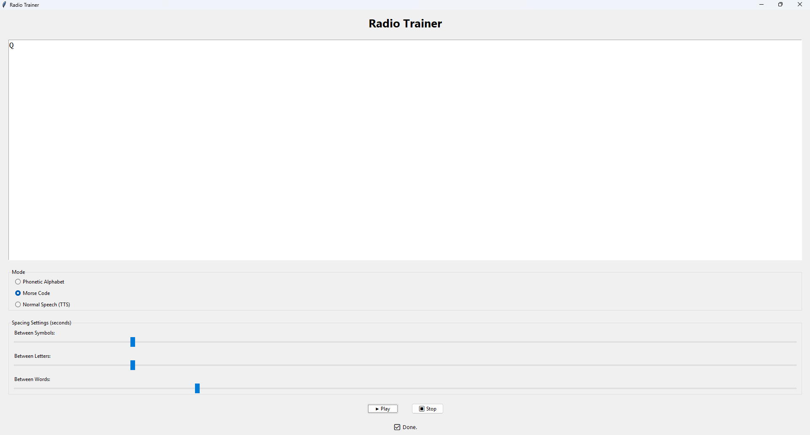

# 📻 Radio Trainer

A desktop app for learning **NATO Phonetic Alphabet** and **Morse code** — built with **Python**, **Tkinter**, **Pygame**, and **pyttsx3**.

quick heads up i tried to make russian phonetics also thats not fully done so yea



---

## ✨ Features

- 🎙️ **Phonetic Mode** — plays each letter (A → ALPHA, B → BRAVO...) with audio clips  
- 🟢 **Morse Mode** — plays dits & dahs (`.` and `–`) using `.wav` tones  
- 🗣️ **Normal Mode** — reads your text aloud using built-in text-to-speech  
- ⚙️ Adjustable spacing for letters, words, and symbols  
- 🎛️ Clean Tkinter interface with sliders and live status updates  

---

## 🧰 Requirements

- Python 3.8+
- `pygame`
- `pyttsx3`
- `tkinter` (built-in)
  
Install dependencies:
```bash
pip install pygame pyttsx3
